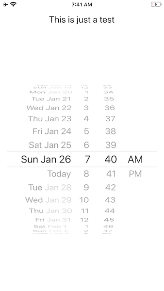

## Demo of Xamarin.Forms UIDatePicker bug on iphone 11 Pro

This repo demonstrates a minimal reproduction of a date picker rendering bug which occurs on iPhone 11 plus and XS - any simulator and a physical 7 plus it renders correctly.

I have tried several combinations of margin, stack layout options, and fiddling with the UIDatePicker properties, all to no avail. I don't know if the bug is present in a 'pure' Xamarin iOS project (sans-Forms).

11 Pro:

7 Plus:

